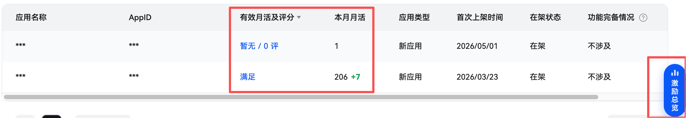
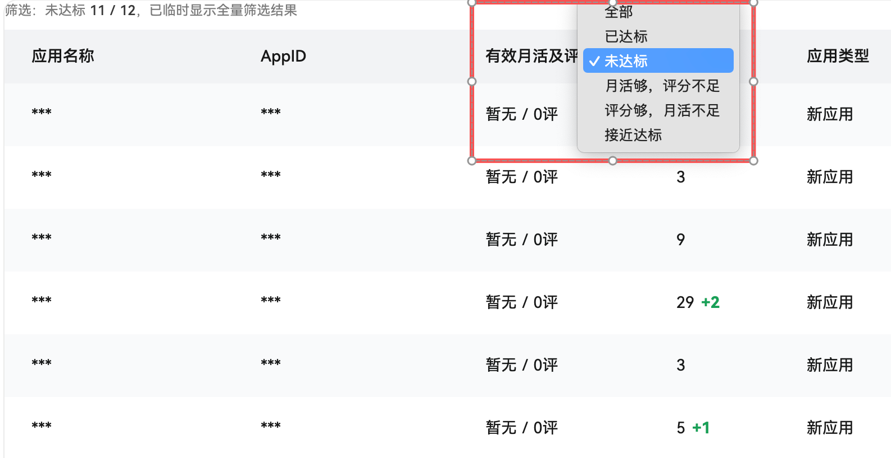
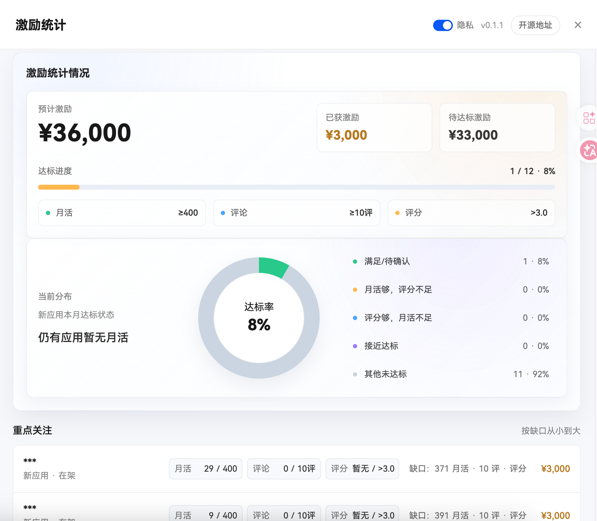

# HarmonyOS 激励数据看板增强插件 
## 使用的帅哥美女们点下star

这是一个用于 2026 鸿蒙开发者激励计划数据页的 Chrome 插件。插件会在华为开发者页面内增强原表格展示，并提供「激励总览」侧边看板，方便查看本月月活、评分评论、达标缺口和预计激励。

适用页面：

```text
https://developer.huawei.com/consumer/cn/activity/harmonyos-incentive/data-query2026
```

## 主要功能

- 在「有效月活及评分」右侧插入「本月月活」列。
- 本月月活支持显示当月增量，例如 `90 +20`。
- 将「暂不满足」状态替换为当前最新评分与评论数，例如 `5.0 / 12评`；无评分时显示 `暂无 / 0评`。
- 在「有效月活及评分」表头加入筛选和排序菜单，支持按达标状态筛选、按月活/评分/评论数排序。
- 页面右侧原生浮窗上方新增「激励总览」入口，点击后打开统计看板。
- 统计看板展示预计激励、已获激励、待达标激励、达标进度、当前分布和重点关注应用。
- 支持隐私模式，开启后隐藏应用名称和 AppID，并会记住设置。
- 插件弹窗保留「获取全部数据」入口，并展示最近捕获数据。

## 更新日志

### v0.14

- 调整「本月月活」绿色增量计算方式，按当天新增显示。
- 当天接口返回值不变时，刷新页面会继续显示当天计算出的增量。
- 跨天后如果接口返回值不变，不再继续显示前一天的增量。
- 修复扩展更新或重载后旧页面读取版本号时可能出现的上下文失效报错。

### v0.13

- 调整「本月月活」绿色增量计算方式，改为和上一次成功刷新保存的月活对比。
- 即使进入新月份，也会继续和上一次保存值对比。
- 修复刷新过程中增量对比值被当前值覆盖，导致只显示最新月活、不显示 `+xx` 的问题。

### v0.12

- 新增月活、评论数、评分排序，支持和筛选组合使用。
- 优化「有效月活及评分」表头菜单，排序和筛选统一使用全量接口数据。
- 优化菜单浮层显示，避免被表格区域裁切，并改善滚动体验。
- 修复切换华为原始分页后，「激励总览」统计重复累计的问题。

## 安装方式

1. 打开 Chrome 浏览器，访问 `chrome://extensions/`。
2. 打开右上角「开发者模式」。
3. 点击「加载未打包的扩展程序」。
4. 选择本项目文件夹。
5. 安装完成后，浏览器工具栏会出现插件图标。

## 使用方式

1. 打开华为激励计划数据查询页面。
2. 登录华为开发者账号，并等待页面表格加载完成。
3. 插件会自动捕获页面接口数据，并增强原始表格。
4. 点击页面右侧浮窗上方的「激励总览」按钮，可以查看统计看板。
5. 需要隐藏敏感信息时，在统计看板顶部打开「隐私」开关。

## 表格增强

### 本月月活

插件会在「有效月活及评分」右侧新增「本月月活」列，展示接口返回的最新月份月活。

月活增量规则：

- 插件会把上一次成功读取到的月活作为对比值。
- 当本次接口返回值大于上一次保存值时，显示绿色增量，例如上次 `80`、本次 `82` 时显示 `82 +2`。
- 当天内如果本次接口返回值和上一次相同，会继续显示当天计算出的绿色增量。
- 到第二天后，如果接口返回值仍和上一次相同，不再显示前一天的绿色增量。
- 如果中间几天没有打开插件，下次打开时会和上一次保存值对比，并把增量记为当天增量。
- 即使进入新的月份，也会继续和上一次保存值对比。
- 如果接口暂时没有返回月活，新列默认显示 `0`。

### 有效月活及评分

官方状态为「满足」的应用保持显示「满足」。

官方状态为「暂不满足」的应用，会显示最新月份的月末评分和月末评分个数：

```text
5.0 / 12评
暂无 / 0评
```

点击该列仍可打开明细弹窗，查看各月份的有效月活、月末评分和月末评分个数。

## 筛选说明

插件会在「有效月活及评分」表头文字后加入下拉箭头。点击表头文字或箭头即可打开筛选和排序菜单。

支持的筛选项：

- 全部
- 已达标
- 未达标
- 月活够，评分不足
- 评分够，月活不足
- 接近达标

支持的排序项：

- 默认顺序
- 月活 高到低 / 低到高
- 评论数 高到低 / 低到高
- 评分 高到低 / 低到高

筛选逻辑：

- 选择「全部」会显示全部应用数据，并保留当前排序。
- 选择「默认顺序」会取消排序，保留当前筛选。
- 选择「恢复页面原样」会直接刷新当前页面，恢复华为原始分页视图。
- 选择筛选或排序项时，插件会先读取全量应用数据，再临时替换当前页面表格内容。
- 筛选结果会隐藏原分页控件，并显示命中数量。
- 「已达标」以华为接口返回的官方状态「满足」为准。
- 「月活够，评分不足」表示最新月份月活大于等于 400，但评论数小于 10。
- 「评分够，月活不足」表示最新月份评论数大于等于 10，但月活小于 400。
- 「接近达标」表示尚未达标，且最新月份月活大于等于 300 或评论数大于等于 8。

## 激励总览

页面右侧华为原生浮窗上方会显示竖排「激励总览」按钮。点击后打开统计看板。

看板内容：

- 预计激励：当前在架应用按活动类型估算的激励金额。
- 已获激励：官方状态已满足目标的应用金额。
- 待达标激励：在架但尚未满足目标的应用金额。
- 达标进度：已满足应用数和总应用数。
- 当前分布：新应用的当前月活、评分评论状态分布。
- 重点关注：按缺口排序展示需要优先关注的应用。

金额规则：

- 新应用按 3000 元估算。
- 热门应用按 10000 元估算。
- 预计激励会统计当前在架应用。
- 已获激励只统计官方状态为「满足」的应用。

## 隐私模式

在「激励总览」面板顶部打开「隐私」开关后，插件会隐藏：

- 应用名称。
- AppID。
- 插件弹窗中的敏感预览字段。

隐私模式会保存到浏览器本地存储，下次刷新页面仍会保持开启或关闭状态。

## 插件弹窗

点击浏览器工具栏中的插件图标，可以查看最近捕获的数据，并手动获取全量应用数据。

弹窗只保留「获取全部数据」按钮，用于主动读取当前账号下的全量激励应用数据。

有任何问题可以联系：微信 `Z13295`。

## 数据与登录说明

- 插件不处理登录流程，请先在华为开发者页面正常登录。
- 插件不保存账号、密码或验证码。
- 插件读取的是已登录页面中的表格内容和接口返回数据。
- 最近捕获的数据、本月月活基准和隐私模式设置会保存在 Chrome 本地存储中。

## 常见问题

### 页面没有显示新增列

请确认当前页面是目标数据查询页，并且表格已经加载完成。可以刷新页面后等待几秒，插件会自动重新插入「本月月活」列。

### 为什么筛选后显示的不是当前分页？

筛选和排序会读取全量接口数据，并临时替换页面表格，所以结果可能包含原本其他分页中的应用。选择「全部」会显示全部应用数据；如果需要恢复华为原始分页，可以在菜单中选择「恢复页面原样」。

### 为什么只看到部分应用数据？

如果接口还没有全部捕获，可以点击插件弹窗中的「获取全部数据」，或打开「激励总览」让插件自动读取全量数据。

### 插件计算的金额是否等同最终发放金额？

不是。插件里的金额是按活动类型进行的辅助估算，最终发放和达标结果以华为官方页面和活动规则为准。

## 注意事项

- 本页面数据通常每日 10:00 起更新，未更新时请刷新或稍后再看。
- 插件依赖华为页面当前结构和接口字段；如果华为页面改版，部分功能可能需要更新。
- 如果账号权限不足、登录失效或接口返回空数据，插件也无法展示对应结果。

## 项目结构

```text
manifest.json
src/
  content/    页面内容脚本，负责数据处理、表格增强、筛选、隐私模式和统计看板
  injected/   注入页面主环境，负责捕获华为页面接口返回
  popup/      浏览器工具栏弹窗页面和交互脚本
```
